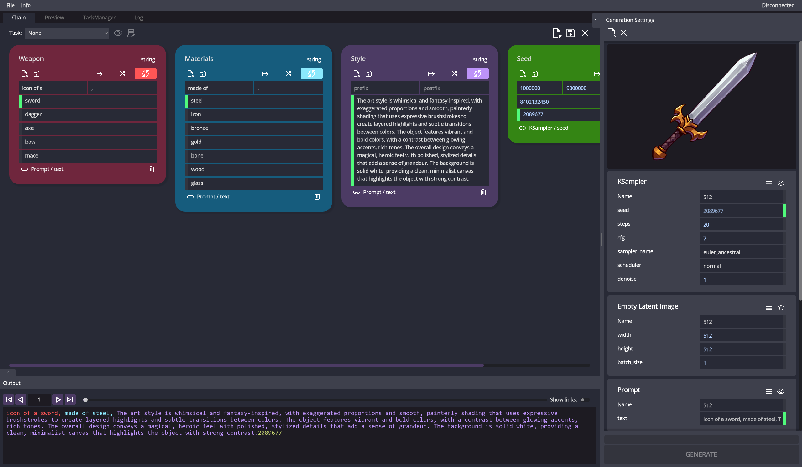

# 🛠️ Module Flow

A desktop application for managing generative pipelines. It lets you build modular prompt chains, control generation parameters, run tasks, and track results - all in one interface.

---

## 🚀 Features

- **Modular prompt chains** with text, numbers, and ranges
- **Auto-linking** between prompts and generation parameters (CFG, seed, resolution, etc.)
- **Task manager** with queueing, status tracking, previews, and execution history
- **API integration** (ComfyUI supported out of the box)

---

## 🧩 Use Cases

- Asset factories with structured templates and mass variation
- Comparative testing of generative models
- Reproducible pipeline setups with saved configurations
- Solo use or collaborative content workflows

---

## 💻 Installation

1. Download the latest build from [Releases](https://github.com/Pecha85/ModuleFlow/releases)
2. Unpack the archive
3. Run `Module Flow.exe` (Windows)

> 🧪 **Linux and macOS builds are in development** and will be released soon

---

## 📦 Dependencies

- Works with **ComfyUI** via WebSocket API
- Support for other engines is planned

---

## 🗺️ Status

The project is in an **early development stage** - interface and logic are evolving, bugs and changes are expected.  
Functionality will expand based on user feedback.

---

## 💬 Feedback and Support

If you're interested in the project or already using it - all feedback, suggestions, and reports are highly appreciated.  
Use [GitHub Issues](https://github.com/Pecha85/ModuleFlow/issues) to report bugs or share ideas and experience.

A Discord server for the project is coming soon, where features, issues, and configurations can be discussed.

If you'd like to support development - a subscription on [Patreon](https://www.patreon.com/PechaSD) is greatly appreciated. It helps speed up development, testing, and feature delivery. Boosty support is also planned.

---

## 📜 License ([EULA](LICENSE.md))

Module Flow is **free for non-commercial use**. A clear commercial licensing plan will be available soon.
